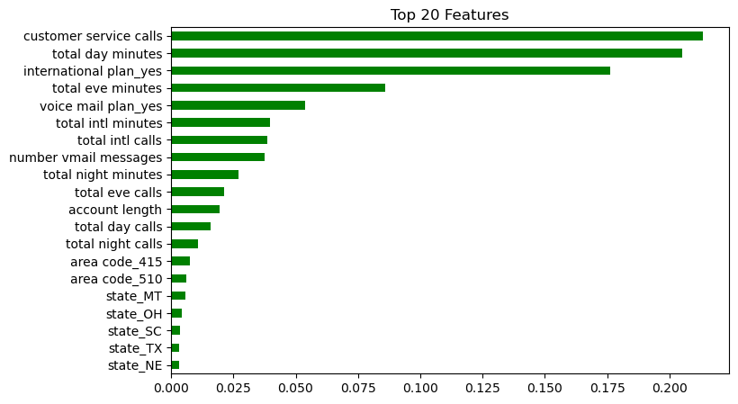
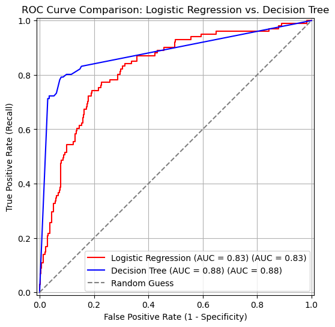
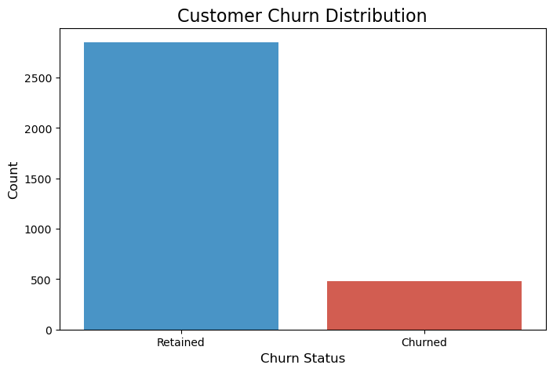

# SyriaTel Customer Churn Prediction – Phase 3 Project

## Overview

This project uses machine learning to predict which customers are likely to stop using SyriaTel, a large telecom company. By identifying customers who may leave early, the company can act fast with special offers or better service to keep them. This helps reduce revenue loss and improve customer satisfactionand customer retention.

---

## Project Goal

The main goal is to build a machine learning model that can predict customer churn (when a customer leaves the company). With this model, SyriaTel can:

- Focus on keeping high-risk customers.
- Save money by reducing customer loss.
- Improve decision-making with data.

---

## Business Need

In telecom, getting new customers is expensive. Losing customers often means losing both money and time spent getting them. SyriaTel has many customers, and it’s hard to track churn manually. A smart, data-based system is needed to find out who might leave—and why—so that action can be taken early.

---

## Key Objectives

### 1. Descriptive
Understand what kinds of customers are more likely to leave:
- What do churned customers have in common?
- Which customer details are linked to churn?

### 2. Diagnostic
Find patterns in how customers use services:
- Do churned customers call customer care more?
- Do they use fewer services?

### 3. Predictive
Use machine learning models like:
- Logistic Regression
- Decision Tree
- Random Forest  
to predict if a customer will churn, and learn which features matter most.

---

## Stakeholders

- **Customer Retention Team**: Use model results to run save-campaigns.
- **Marketing Team**: Create offers for high-risk groups.
- **Product Managers**: Improve services that may cause customers to leave.
- **Data Team**: Maintain and update models.
- **Company Leadership**: Make smart business decisions using churn trends.

The project was tackeled using the following pipeline:
- Exploratory Data Analysis (EDA)
- Feature Engineering
- Machine Learning Model Building
- Model Evaluation and Business Insight Generation

---

## Key Visualizations

### 1. Feature Importance (Decision Tree)

  
*Top features influencing churn: `customer_service_calls`, `international_plan`, `total_day_minutes`.*

### 2. ROC Curve – Model Comparison

  
*The Decision Tree model outperformed Logistic Regression with a higher AUC of **0.88***.

### 3. Churn Class Distribution

  
*Original data showed class imbalance; resolved using SMOTE for better model fairness.*

---

## Insights & Patterns

- Customers with **international plans** are **2.5x more likely to churn**.
- Those with **4 or more customer service calls** often indicate dissatisfaction.
- High **daytime call minutes (>300)** correlate with higher churn risk.

```python
# Top 3 features from Decision Tree are:
important_features = ['customer_service_calls', 'international_plan_Yes', 'total_day_minutes']
important_features
```

---

## Model Evaluation

| Model               | Recall (Churn) | AUC  | False Negatives |
|--------------------|----------------|------|-----------------|
| Logistic Regression | 74%            | 0.83 | 119             |
| **Decision Tree**   | **78%**        | 0.88 | **22**          |

---

## Business Recommendations

1. **Retention Campaigns**  
   Target customers with high service calls or international plan usage with customized offers.

2. **Service Quality Reviews**  
   Investigate frequent service call triggers and optimize support processes.

3. **Early Churn Flagging System**  
   Integrate model predictions into SyriaTel’s CRM for real-time alerts and customer follow-up.

---

## Contact

For questions, feedback, or collaborations:

- 📧 Email: [davieskiyaka125@gmail.com](mailto:davieskiyaka125@gmail.com)  
- 💼 LinkedIn: [Davies Kiyaka](https://www.linkedin.com/in/davies-kiyaka-ab9230299/)  
- 🖥️ GitHub: [Davies125](https://github.com/Davies125)

---
